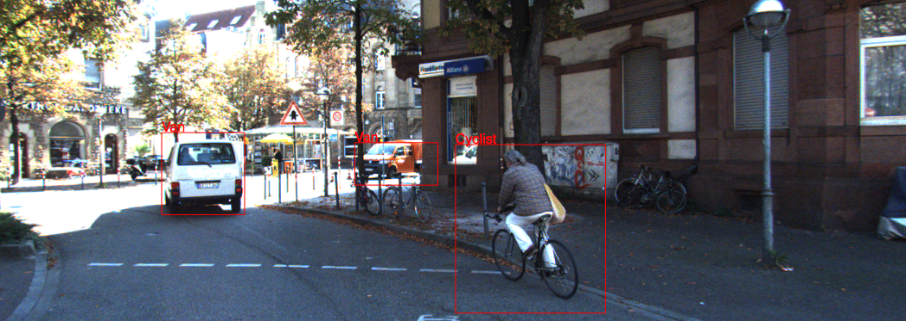

torch-KITTI
===========

lua-torch code to load KITTI dataset


dependency lua--xml

```bash
git clone  http://github.com/clementfarabet/lua---xml
cd lua---xml
luarocks make
```

For the demo:
 You need to download images from: http://www.cvlibs.net/datasets/kitti/raw_data.php 
 > - synced+rectified data
 > - tracklet

The images folder ending with 'sync' has folders with images put tracklet_labels.xml in the same folder.
Modify dspath, absolute path to sequence base directory (ends with _sync), in demo_kitti.lua.

```bash
qlua demo_kitti.lua
```




